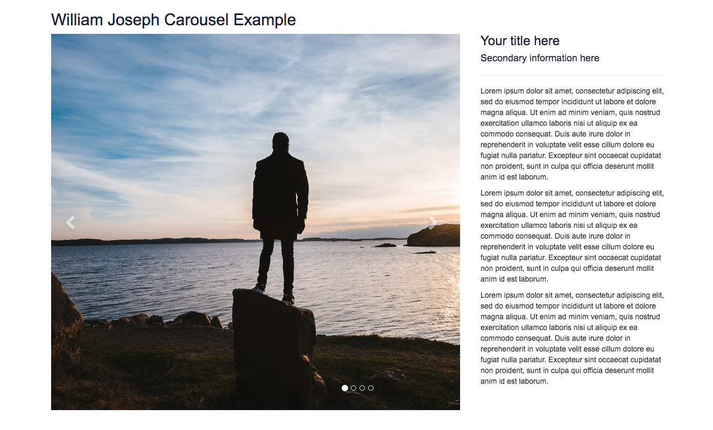

# Bootstrap Carousel Example
A quick version of the responsive Bootstrap Carousel with a 2/3 square image and column of text
Built as a php index with all its dependencies, but would work with most Bootstrap implementations

See demo [here](http://www.jamesgadsby.co.uk/carousel/)

